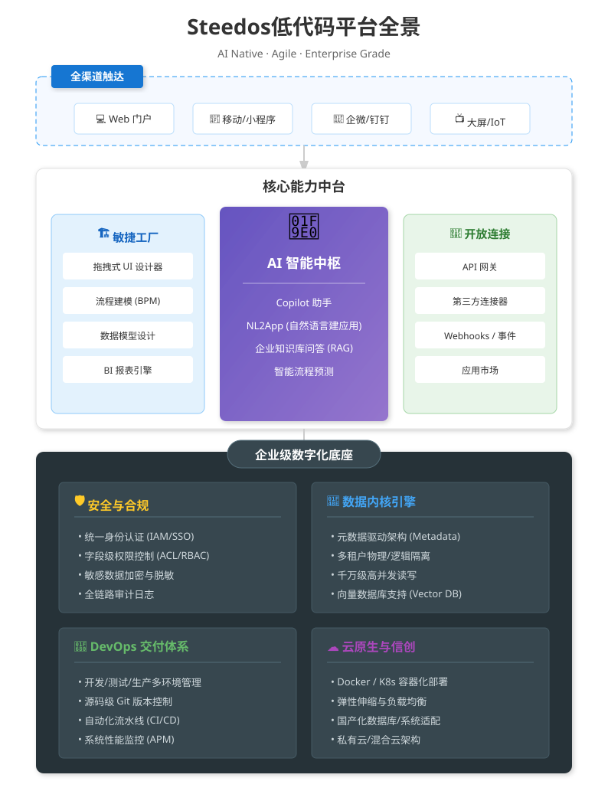

<p align="center">
  <a href="https://docs.steedos.com/en/">
    
  </a>
</p>

<h1 align="center">Steedos Platform</h1>

<p align="center">
  <strong>The Open Source Low-Code Platform for Enterprise</strong>
</p>

<p align="center">
  <em>Metadata-driven core. Fusing low-code efficiency with pro-code flexibility. <br/>Connecting enterprise data to reshape business innovation.</em>
</p>

<p align="center">
  <a href="https://www.npmjs.com/package/@steedos/server"></a>
  <a href="https://hub.docker.com/r/steedos/steedos-community"></a>
  <a href="./LICENSE"></a>
</p>

<p align="center">
  <a href="./README_cn.md">中文 (Chinese)</a> •
  <a href="https://www.steedos.com/" target="_blank">Website</a> •
  <a href="https://docs.steedos.com/" target="_blank">Documentation</a> •
  <a href="https://github.com/steedos/steedos-templates">Examples</a> •
  <a href="https://github.com/steedos/steedos-platform/discussions">Community</a>
</p>

<br/>

## 📖 Introduction

**Steedos Platform** is an open-source low-code development platform powered by a **Metadata Driven** architecture.

We aim to be the "Linux" of the low-code world—providing the powerful enterprise core of **Salesforce** (Object Modeling, Permission Engine, Automation) combined with the flexibility of open source and a modern tech stack (**Node.js**, **MongoDB**, **React**, **Amis**).

Whether building CRM, ERP, OA, or complex industry-specific business systems, Steedos helps you achieve **10x development efficiency** while ensuring complete autonomy over your code and data.

<br/>
<p align="center">
  
</p>
<br/>

## ⚡ Why Steedos?

| Feature | Steedos Platform | Salesforce | Traditional Coding |
| :--- | :--- | :--- | :--- |
| **Core Architecture** | 🧠 **Metadata Driven** | 🧠 Metadata Driven | 📄 Hard-coded |
| **Dev Mode** | 🚀 **Visual + Code (Dual Mode)** | ⚠️ Proprietary (Apex) | 🐢 Code Only |
| **Deployment** | ☁️ **On-Prem / Private Cloud** | 🔒 Public Cloud Only | ☁️ Any |
| **Frontend Tech** | ⚛️ **React + Amis** | ⚠️ Aura / LWC | ⚛️ Any |
| **Data Sovereignty**| 🛡️ **100% Self-Hosted** | ❌ Vendor Lock-in | 🛡️ 100% |
| **Cost** | 💰 **Open Source / Commercial** | 💰💰💰 Expensive Subscription | 💰💰 High Labor Cost |

## 🌟 Core Capabilities

### 1. 🎨 Visual Modeling & Page Designer
Say goodbye to tedious SQL scripts. Define enterprise-grade data models with just a few clicks.
* **Object Modeling**: Supports 20+ field types, easily handling complex relationships like Lookup and Master-Detail.
* **Page Engine**: Deeply integrated with the **Baidu Amis** framework, allowing drag-and-drop design for Forms, List Views, Kanbans, and Dashboards.
* **Benchmark**: A perfect alternative to Salesforce Object Manager and Lightning App Builder.

### 2. 🤖 Intelligent Automation Engine
Built-in \process engine to meet complex enterprise approval scenarios.
* **Workflow**: Automate field updates, email notifications, and Webhook triggers.
* **Approval Processes**: Supports countersignatures, add-approvers, kickbacks, sub-processes, and other complex logic.
* **Logic Orchestration**: Visually configure business rules without writing code.

### 3. 🛡️ Enterprise-Grade Security
Provides granular permission control to ensure data security.
* **Multi-dimensional Control**: Supports Object-level, Field-level, and Record-level (Sharing Rules) permissions.
* **Org Structure**: Comprehensive management of Departments, Users, Roles, Profiles, and Permission Sets.

### 4. 💻 Developer First (Steedos DX)
Low-code doesn't mean "Black Box". We provide professional engineering tools for developers.
* **Code as Configuration**: All metadata is stored in YAML/JSON formats.
* **GitOps**: Full support for Git version control, easily integrating into CI/CD pipelines.
* **VS Code Extension**: Provides syntax highlighting, auto-completion, and bi-directional metadata synchronization.
* **API First**: Automatically generates ready-to-use GraphQL and RESTful APIs.


## 🏗️ Architecture

Steedos adopts a responsive microservices architecture with separated frontend and backend, built on the Moleculer framework.

* **Backend Core**: Node.js, Moleculer (Microservices), TypeScript
* **Data Storage**: MongoDB (Metadata Repository), SQL Databases (Business Data)
* **Frontend**: React, Amis (Open Source Low-Code Framework)


## 🚀 Quick Start

### Option 1: Docker (Recommended)

The fastest way to experience Steedos:

```bash
docker run -d -p 80:80 steedos/steedos-community:latest
````

### Option 2: Create New Project (For Developers)

Create a standard engineering project using the scaffold:

```bash
# Create project
npx create-steedos-app my-project

# Enter directory and install dependencies
cd my-project
yarn install

# Start the server
yarn start
```

Visit `http://localhost:5100` to start building.

## 🤝 Community & Contributing

Steedos is a fully open-source project, and we welcome all forms of contribution\!

  * 🐛 **Report Issues**: [GitHub Issues](https://github.com/steedos/steedos-platform/issues)
  * 💬 **Discussions**: [GitHub Discussions](https://github.com/steedos/steedos-platform/discussions)
  * 🛠️ **Contribute**: Please read [CONTRIBUTING.md](https://www.google.com/search?q=./CONTRIBUTING.md)

## Contact Us


