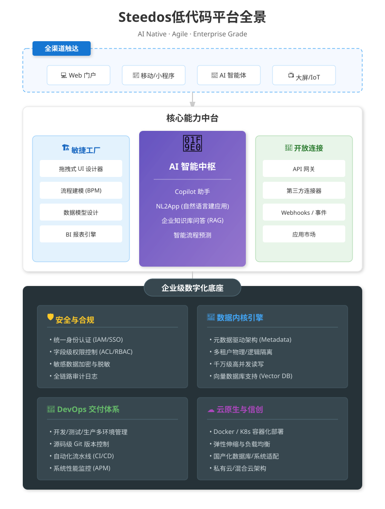

<p align="center">
  <a href="https://docs.steedos.com">
    
  </a>
</p>

<h1 align="center">Steedos Platform (华炎魔方)</h1>

<p align="center">
  <strong>企业级开源低代码开发平台 | The Open Source Low-Code Platform for Enterprise</strong>
</p>

<p align="center">
  <em>以元数据为核心，融合低代码的高效与 Pro-Code 的灵活，连接企业数据，重塑业务创新。</em>
</p>

<p align="center">
  <a href="https://www.npmjs.com/package/@steedos/server"></a>
  <a href="https://hub.docker.com/r/steedos/steedos-community"></a>
  <a href="./LICENSE"></a>
</p>

<p align="center">
  <a href="./README.md">English</a> •
  <a href="https://www.steedos.com/" target="_blank">官网</a> •
  <a href="https://docs.steedos.com/" target="_blank">文档</a> •
  <a href="https://github.com/steedos/steedos-templates">示例</a> •
  <a href="https://github.com/steedos/steedos-platform/discussions">社区</a>
</p>

<br/>

## 📖 简介 | Introduction

华炎魔方（Steedos）是一款基于元数据驱动（Metadata Driven）架构的开源低代码平台。我们致力于为企业提供像 Salesforce 一样强大的建模能力，同时保持开源的灵活性和低成本。

通过可视化建模、自动化流程引擎和即由即用的 API 能力，华炎魔方帮助企业将开发效率提升 10 倍以上。无论是构建 CRM、ERP 还是复杂的行业业务系统，Steedos 都能提供坚实的底层支撑。

[](https://docs.steedos.com/diagrams/steedos-overview-zh-CN.svg)

## ⚡ 为什么选择华炎魔方？

| 特性 | 华炎魔方 (Steedos) | Salesforce | 传统代码开发 |
| :--- | :--- | :--- | :--- |
| **核心架构** | 🧠 **元数据驱动 (Metadata)** | 🧠 元数据驱动 | 📄 硬编码 |
| **开发模式** | 🚀 **可视化 + 代码 (双模)** | ⚠️ 仅限专有语言 (Apex) | 🐢 纯代码 |
| **部署方式** | ☁️ **私有部署 / 混合云** | 🔒 仅限公有云 | ☁️ 任意 |
| **前端技术** | ⚛️ **React + 百度 Amis** | ⚠️ Aura / LWC | ⚛️ 任意 |
| **数据主权** | 🛡️ **100% 自主可控** | ❌ 厂商锁定 | 🛡️ 100% |
| **使用成本** | 💰 **开源免费 / 商业授权** | 💰💰💰 昂贵的订阅费 | 💰💰 人力成本高 |

## 🌟 核心功能 | Core Features

### 1\. 可视化数据建模

无需编写 SQL，通过图形化界面即可定义复杂的业务对象及其关系（Lookup, Master-Detail）。

  * 支持 20+ 种字段类型。
  * 内置公式字段与汇总字段（Roll-up Summary）。
  * **亮点：** 代码即配置，所有模型均以 `.yml` 或 `.json` 格式存储，完美支持 Git 版本控制。

### 2\. 强大的流程引擎

内置企业级工作流引擎，支持复杂的中国式审批场景。

  * 可视化流程设计器。
  * 支持会签、加签、回退、子流程。
  * 流程与业务数据无缝绑定。

### 3\. 自动生成 API

定义好对象模型后，平台自动为您生成生产环境可用的 API。

  * **GraphQL API:** 灵活查询，按需获取数据。
  * **REST API:** 标准化接口，易于第三方集成。
  * 内置 Swagger 文档。

### 4\. 页面设计器

基于百度 Amis 框架，提供拖拽式的页面布局设计能力。

  * 所见即所得的表单设计。
  * 灵活配置列表视图、看板视图、日历视图。
  * 支持自定义组件扩展。

### 5\. 开发者优先

低代码不代表无代码。华炎魔方专为开发者设计了极其友好的扩展机制。

  * **服务端扩展:** 使用 Node.js 编写 Trigger（触发器）和 函数
  * **客户端扩展:** 使用 React 开发自定义组件。
  * **Steedos DX:** 提供 VS Code 插件和 CLI 工具，支持元数据同步与 DevOps 流水线。

## 🏗️ 技术架构
华炎魔方采用分层架构设计，实现了 UI、业务逻辑与数据存储的完全解耦，支持微服务部署与无限水平扩展。

### 核心架构分层：

1.  **基础设施层:** 支持 Docker/K8s 容器化部署，兼容 AWS, Azure, 阿里云及私有云环境。
2.  **数据持久层 :** 支持 MongoDB (文档型) 和主流 SQL 数据库（通过 TypeORM 适配），保证海量数据的高性能读写。
3.  **元数据引擎:** 平台的核心大脑。
      * **对象模型:** 定义字段、关系、验证规则。
      * **权限引擎:** 字段级、记录级的精细化权限控制。
      * **ObjectQL 引擎:** 强大的对象查询语言。
4.  **服务层 (Service Layer):**
      * **流程引擎:** 可视化设计业务流程。
      * **API 网关:** 自动生成 GraphQL 和 RESTful API。
      * **自动化规则:** Workflow Rules, Approval Processes.
5.  **交互层:**
      * 内置基于 React 的管理后台。
      * 无缝集成 Amis 百度开源低代码前端框架。
      * 支持移动端 (Mobile) 及微前端架构。

## 🚀 快速开始 | Quick Start

### 方式一：Docker 一键启动 (推荐)

最快体验华炎魔方的方式：

```bash
docker run -d -p 80:80 steedos/steedos-community:3.0
````

### 方式二：创建新项目 (开发者)

使用脚手架创建标准的工程化项目：

```bash
# 创建项目
npx create-steedos-app my-project

# 进入目录并安装依赖
cd my-project
yarn install

# 启动服务
yarn start
```

访问 `http://localhost:5100` 即可开始使用。


## 🧩 生态与集成 | Ecosystem

华炎魔方不仅仅是一个孤岛，它拥有强大的连接能力：

  * **身份认证:** 支持 OIDC, SAML, LDAP, Active Directory 集成。
  * **第三方连接:** 预置企业微信、钉钉、飞书连接器。
  * **数据集成:** 轻松通过 ETL 工具连接 SAP, Oracle 等传统 ERP。

## 🤝 贡献与社区 | Community

华炎魔方是完全开源的项目，我们欢迎任何形式的贡献！

  * 🐛 **报告问题**: [GitHub Issues](https://github.com/steedos/steedos-platform/issues)
  * 💬 **讨论交流**: [GitHub Discussions](https://github.com/steedos/steedos-platform/discussions)

## 联系我们

 
