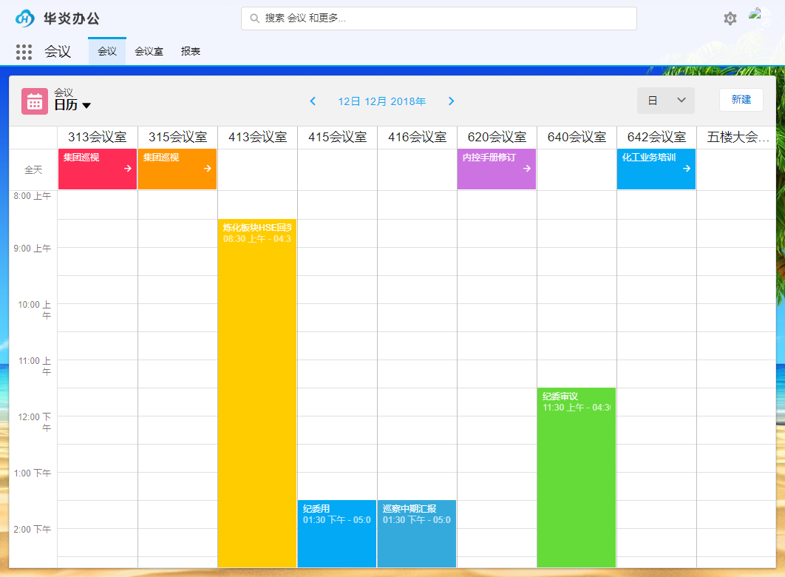

# 会议管理系统
本系统基于[Steedos](https://github.com/steedos/object-server)开发。您只需要在这里的[配置业务对象](src/)，设定对象、关系、字段、视图、触发器、报表，即可拥有一套自定义的会议管理系统。



### 安装前准备
- [Install NodeJS, v8.0.0 or later.](https://nodejs.org/en/)
- [Install MongoDB Community Server v3.4 or later](https://www.mongodb.com/download-center/community)
- [Install Visual Studio Code](https://code.visualstudio.com/)

### 安装 yarn
```
npm i yarn -g
```

### 国内建议使用npm淘宝镜像
```
npm config set registry http://registry.npm.taobao.org/
```

### 使用yarn安装依赖包
```
yarn
```

### 启动服务器
```
yarn start
```

### 了解更多
- [开发文档](https://steedos.github.io)

### docker-compose方式启动服务
```
docker-compose up -d
```
如果修改了代码或者配置，执行`docker-compose build --no-cache`后，`docker-compose up -d`
