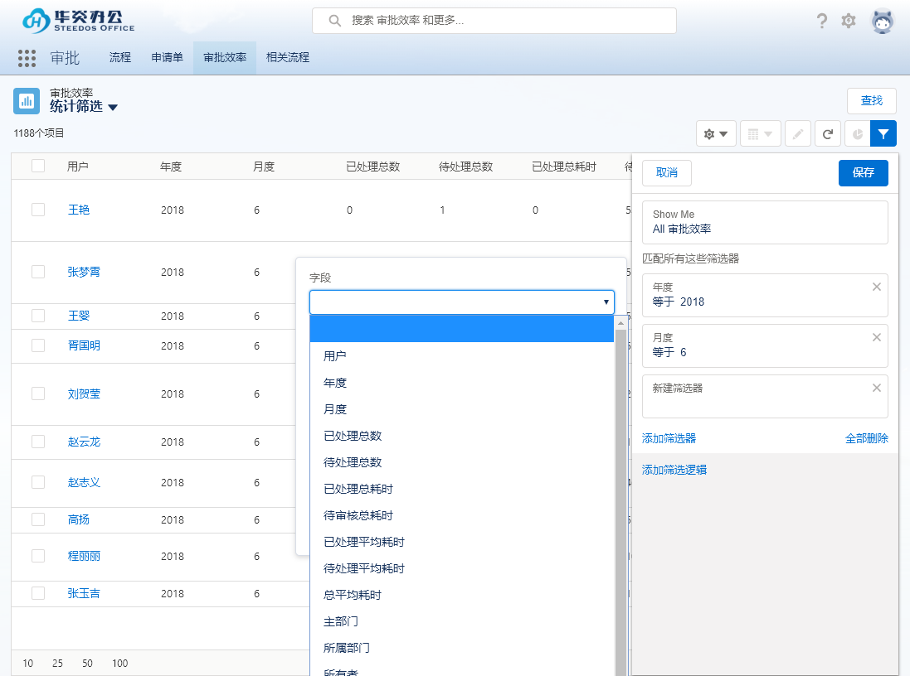
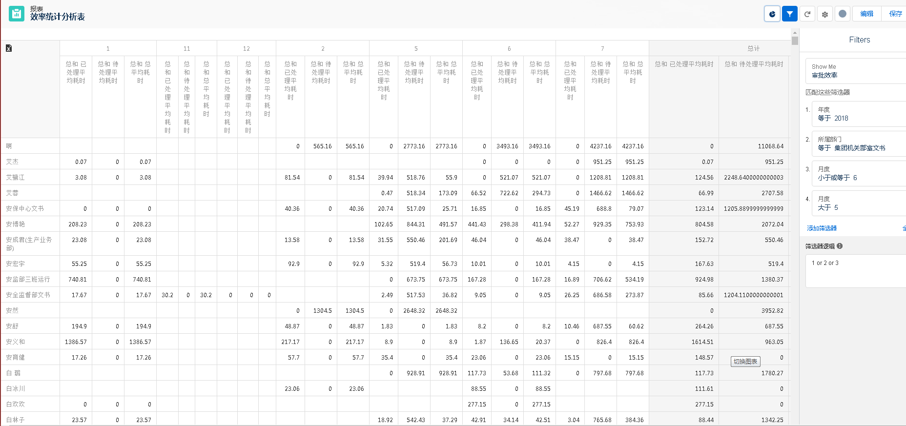

## 功能说明

效率统计，作为衡量企业员工工作量和工作效率的统计工具，也是企业明确人力资本使用情况的分析工具。

Creator效率统计，与审批王的公文处理相结合，通过接口定时抓取用户工作的业务数据，并根据原始数据计算用户的工作量和工作效率。

## 功能介绍

### 抓取数据整合

通过配置定时任务，Creator后台定时从审批王系统抓取用户处理公文的相关数据，包括用户处理公文数量、处理每个公文的耗时，以及截止统计时刻用户的待办数量等原始数据。

Creator获取原始数据后进行统计计算，根据处理每个公文的耗时计算出用户的处理文件总耗时，并根据截至统计时刻用户待办数量计算出公文停留的总耗时。并根据总耗时，计算出平均耗时。最终，计算出每个用户的工作效率数据，记录在效率统计表中。

### 统计表格

Creator平台将整合的效率统计数据，按用户以表格的形式展示的页面上。表格各列字段说明：

 - 用户：统计用户

 - 年度：统计年度

 - 月度：统计月度

 - 已处理总数：用户当月已处理文件的数量

 - 已处理总耗时(小时)：用户当月已处理文件的耗时总和

 - 已处理平均耗时(小时)：用户当月处理文件的平均耗时 (已处理总耗时 / 已处理总数)

 - 待审核总数：截止统计时刻，用户待办文件的总数量

 - 待审核总耗时(小时)：截止统计时刻，用户接收待办文件后滞留时长的总和

 - 待审核平均耗时(小时)：截止统计时刻，用户所有待办文件的平均滞留时长 (待审核总耗时 / 待审核总数)
 
 - 总平均耗时(小时)：(已处理总耗时 + 待审核总耗时) / (已处理总数 + 待审核总数)

### 筛选器

Creator平台提供了灵活的筛选器功能，通过筛选器，用户可根据不同参数过滤数据。比如，用户可按照部门筛选，也可按照年度月度进行筛选。

### 权限管理

对于统计数据，不同的用户查看的范围也不同。默认情况下，普通用户仅可查看本人各月度的统计数据，系统管理员则可以查看全部用户的统计数据。

同时，系统管理员也可配置相应的权限组，权限组中的用户可配置更多不同的权限。

### 统计分析报表

Creator平台的报表功能，能够将审批效率数据转化为各种直观的统计报表，便于企业多维度的对员工工作效率进行了解。

