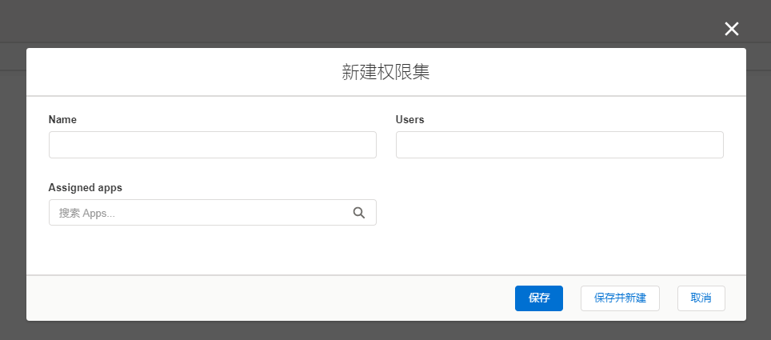
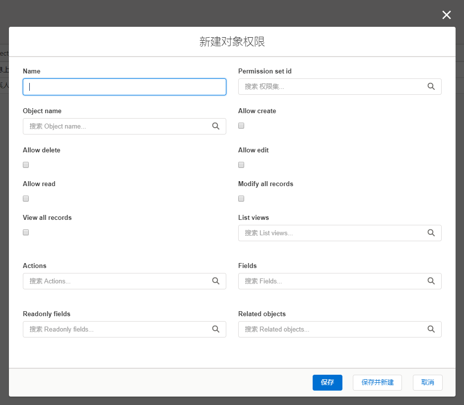

### 1.概述
可通过配置权限集及对象权限来实现对不同用户的各种查看/操作权限控制。

### 2.关于权限集
### 2.1.权限集定义
一个权限集指的是一个权限配置单位，每个单位需要指明要约束到的用户范围。
> 默认存在两个权限集，一个是user，指所有用户通用的权限设置，另一个是admin，指所有工作区管理员通用的权限设置。

> 可以根据实际需要添加不同的权限集来表示不同的权限作用范围。

> 同一个用户可能属于多个权限集，比如管理员不但是属于admin这个权限集，也属于user这个权限集。

### 3.1.权限集配置
可为权限集配置以下关联属性：
- users[约束哪些用户]
- assigned_apps[允许查看的应用]
> 默认的user/admin权限集不需要指定users属性，因为其约束的用户范围是固定且不可变更的，但是可以为其指定assigned_apps属性来限制允许查看哪些应用。

### 3.关于对象权限
### 3.1.对象权限定义
每个对象可以配置自己的个性化权限属性，如果某个对象没有配置权限则以默认的权限配置为准。

### 3.2.对象权限配置
可为对象配置以下权限属性：
- allowCreate[是否允许创建记录]
- allowDelete[是否允许删除记录]
- allowEdit[是否允许修改记录]
- allowRead[是否允许查看记录]
- modifyAllRecords[是否允许修改全部记录]
- viewAllRecords [是否允许查看全部记录]
- listviews[允许查看的视图]
- actions[允许查看的操作按钮]
- fields[允许查看的对象字段]
- readonly_fields[只读的对象字段]
- related_objects[相关列表显示哪些列表数据]


默认的权限配置:
```
permission_set:
    user:
        allowCreate: true
        allowDelete: true
        allowEdit: true
        allowRead: true
        modifyAllRecords: false
        viewAllRecords: false 
    admin:
        allowCreate: true
        allowDelete: true
        allowEdit: true
        allowRead: true
        modifyAllRecords: true
        viewAllRecords: true 
```

### 4.应用规则

因为同一个用户可能属于多个权限集，所以当前用户的权限需要通过一套规则计算得出，大致规则分为两块。

### 4.1.通过权限集的优先次序来计算权限规则：
- 适用于allowCreate/allowDelete/allowEdit/allowRead/modifyAllRecords/viewAllRecords属性，且它们值都是boolean类型。
- 优先次序的应用规则是高优先级别的权限集中设置为true时直接应用true值，反之为false时，取下一级更低级别的权限集值，直到遇见true值或最低级别的权限集值。
- 优先次序为：非user/admin默认权限集>admin权限集>user权限集。

> 根据上述规则，如果对象默认的admin/user权限集的上述适用属性值为true时，用户通过添加其他权限集配置来把相关属性设置为false是无效的。
比如默认情况下所有对象的user权限集的allowRead为true，那么如果想让某个非管理员用户看不到某个对象，把这个allowRead为true的配置分配到某个非user/admin默认权限集中是无效的，只能把allowRead为true的配置分配到user这个权限集来覆盖默认的user权限集配置。

### 4.2.通过叠加或取交集来计算权限规则：
- listviews应该叠加，表示用户在任何一个权限集中配置的视图都显示，如果叠加后为空，则显示全部视图。
- actions应该叠加，表示用户在任何一个权限集中配置的操作按钮都显示，如果叠加后为空，则显示全部操作按钮。
- fields 应该叠加，表示用户在任何一个权限集中配置的字段都显示，如果叠加后为空，则显示全部字段。
- related_objects 应该叠加，表示用户在任何一个权限集中配置的相关列表都显示，如果叠加后为空，则显示全部相关列表。
- readonly_fields 应该取交集，即取数组的and，表示用户在每一个权限集中都配置为readonly的字段才隐藏。


### 5.权限设置方法
#### 先添加一个权限集


#### 再添加一个对象权限


>注意，如果想覆盖admin或user权限集的默认配置，需要先相应的添加一个名称为admin或user的权限集，然后在添加对象权限时，分配其权限集属性为刚新建的admin或user权限集。