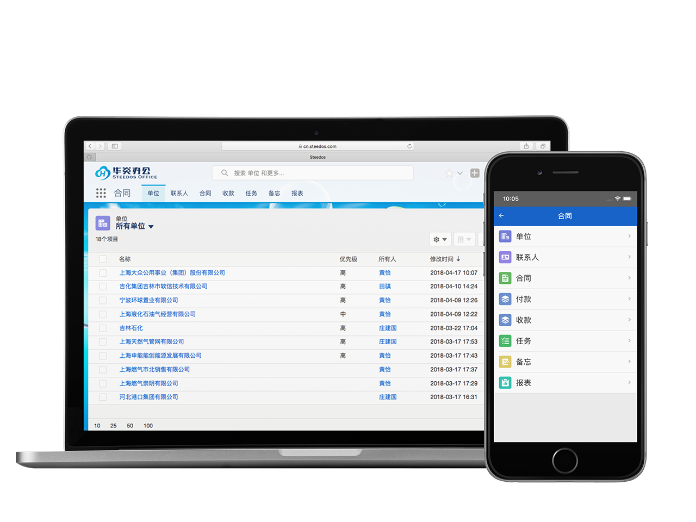
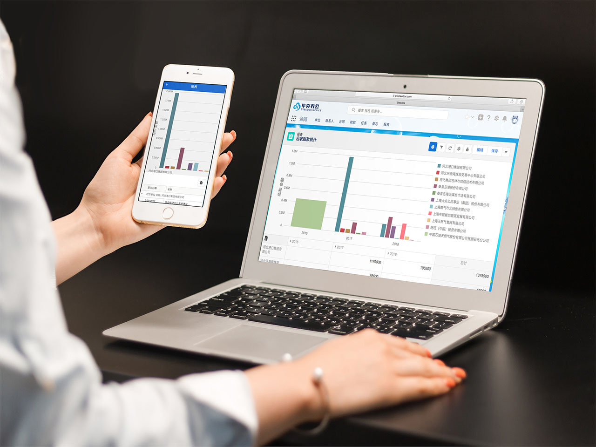

手机客户端
===

对于系统中配置的业务对象，提供手机端操作界面。
- 应用主页面
  - 浏览、选择对象
- 记录浏览界面
  - 下拉刷新数据
  - 向上滚动时自动翻页
  - 切换视图
  - 输入关键词搜索记录
- 记录显示页面
  - 记录详细信息
  - 记录相关子表信息
  - 新增子表记录
  - 上传、下载附件
- 记录新增
- 记录修改
- 记录删除
- 报表显示页面

### 应用主界面

### 记录显示

### 编辑记录

### 搜索

### 报表

