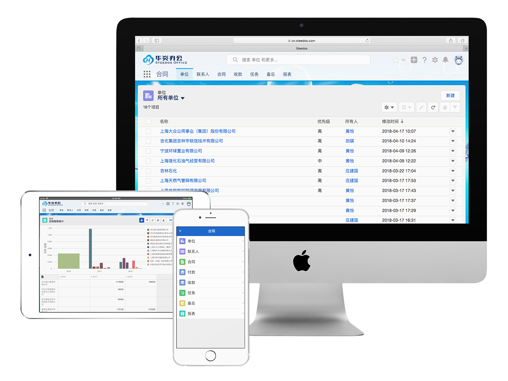

Steedos Object Schema 是一套跨平台、跨语言的对象描述语法。与传统的ORM标准不同，Steedos 不仅可以定义字段、校验、关系，还可以为后端定义触发器、权限，为前端定义视图、报表、过滤等内容。

比如你可以这样定义对象 account.object.yml
```yaml
name: Account
label: 单位
description: 统一保存客户、合作伙伴、供应商数据
fields:
  name: 
    type: String
    label: 标题 
  priority:
    type: String
    label: 优先级
  owner:
    label: 所有人
    type: lookup
    reference_to: User
```

Steedos Object Server 是 Steedos Object 服务端运行环境。
- 根据定义的对象视图，生成数据浏览和查询界面。可设定列表字段、过滤条件、排序规则。所有的数据均按照设定的对象权限进行过滤，确保最终用户只能看到授权的数据。
- 根据用户权限，进行增删改操作；
- 根据定义的对象报表，展示统计分析结果；
- 管理界面，可以设定组织结构、用户、权限、系统参数；



想要开发自己的客户端或是手机App吗？Steedos Object Server立刻华丽转身成为你的API服务器。
- 使用 [ODATA API](http://odata.org) 协议访问所有对象数据
- 使用 [GraphQL API](http://graphql.org) 协议访问所有对象数据 (即将上线)

为了简化用户开发，我们正在开发以下控件库：
- 使用 [React Components](https://reactjs.org/) 开发网页端界面 (即将上线)
- 使用 [React Native Components](https://facebook.github.io/react-native/) 开发手机端端界面 (即将上线)

Steedos Object Server 设计的目的是为了连接到任何数据源，包括SQL或MongoDB数据库，也可以是类似Salesforce、SAP等API接口。

目前我们已发布的 Steedos Object Server 1.0 可以连接到 MongoDB 数据库，连接SQL数据库的版本也正在紧锣密鼓的开发中。

Steedos Object Schema 的创意来自 [Salesforce Lightning Platform](https://www.salesforce.com/products/platform/)，很多设计标准遵循了 Salesforce 的规范。
- [Salesforce Lightning Design System](https://www.lightningdesignsystem.com/)
- [Salesforce Lightning Design System in React ](https://react.lightningdesignsystem.com/)