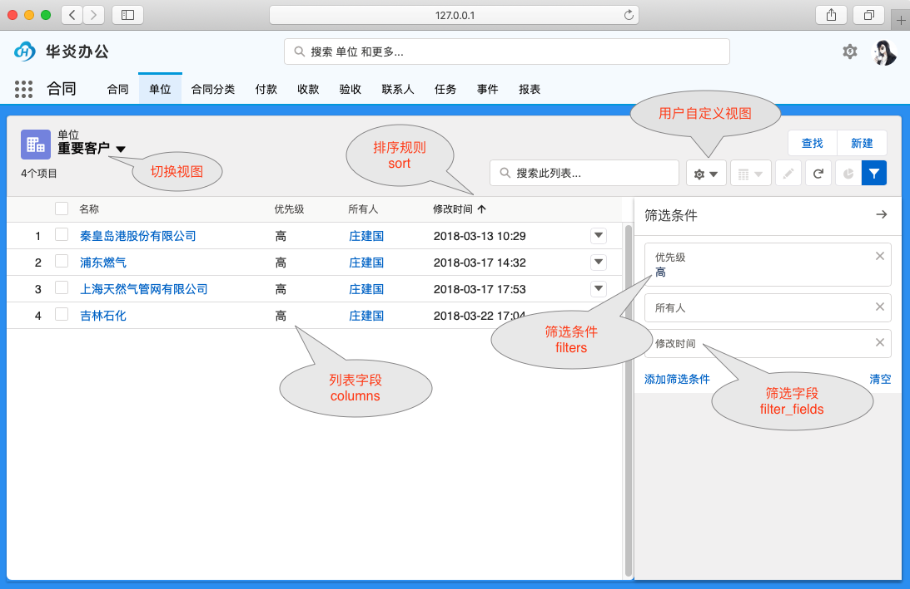

列表视图用来定义数据列表的显示样式，列表视图可以定义显示的字段、筛选条件和排序规则等参数。 例如对于任务(Task)对象，可以定义待办任务、已办任务、交办任务等多个视图。

最终用户在界面上可以很方便的切换列表视图，增加新的筛选条件，也可以自定义自己的列表视图。


```yaml
list_views:
  priority_high:
    label: 重要客户
    columns:
      - name
      - priority
      - owner
      - modified
    filters: [["priority", "=", "high"]]
    filter_fields: ["priority", "owner", "modified"]
    sort: [["modified", "asc"]]
```

## 列表视图配置

### 名称 name
每个对象下的视图名称必须是唯一的。视图名称必须以英文开头，符合命名规范。

### 显示名称 label
列表视图的显示名称显示在列表左上角，用户可以点击下拉箭头切换列表视图。
如果未设置，则默认为列表视图名称。

### 过滤条件 filters
可以设定列表视图的[过滤条件(filters)](object_filter.md)，只有符合过滤条件的数据才会显示在列表中。
```yaml
filters: [["priority", "=", "high"]]
```

### 列 columns
定义在列表视图显示的列(columns)：列表上显示哪些字段，以及显示的先后顺序。
columns需定义为数组，元素为可以是字段名称，也可以是一个列描述对象。

简要定义：
```yaml
columns: ["name", "priority", "owner", "modified"]
```

高级定义：
```yaml
columns: 
  - name
  - field: priority 
    width: 100
    wrap: true
  - owner
  - modified
```
列描述对象属性如下：
- field: 字段名。
- width: 字段宽度，不填写为自动宽度。
- wrap: 显示此字段时是否自动换行，默认为不换行，超出部分显示为... 。

### 排序规则 sort
定了列表数据的排序规则，可以设定多个字段的组合排序。如果未指定，默认的排序规则是按创建时间倒序排列，也就是如下代码：
```yaml
sort: [["modified", "asc"]]
```

### 用户筛选字段 filter_fields
列表视图的右侧有过滤器，用户点击进入后默认就有这些默认的过滤字段，可快速设置过滤条件，显示出符合条件的数据。
filter_fields需定义为数组，元素为对象的字段名称。
```yaml
filter_fields: ["priority", "owner", "modified"]
```

### 滚动条样式 scrolling_mode
定义数据列表的滚动条显示样式。
- standard：按照传统的分页显示，点击页码加载对应页面的数据。
- virtual：通过滚动条切换页面，当滚动到对应页面时，会远程加载数据。
- infinite：滚动刷新，初始只加载第一页，一边滚动一边加载下一页。
```yaml
scrolling_mode: "standard" # or "virtual" | "infinite"
```

### 过滤范围 filter_scope
目前只支持两种过滤范围。
- 工作区 space （默认）：只能当前工作区的数据
- 我的 mine：只能查看当前登录用户的数据
```yaml
filter_scope: "mine"
```

### 共享 shared
设置是否共享该视图给工作区其他人员。只有工作区管理员可以创建共享视图，共享的视图工作区内所有用户都能看到，非共享的视图只有创建者自己可用。
开发人员用代码定义的列表视图默认都是共享视图。

## 最近查看视图
系统内置了一个recent视图，用于显示用户各自最近查看的记录。开发人员只可以为最近查看视图定义 label、 columns，其他参数不起作用。
```yaml
list_views:
  recent:
    label: 最近查看
    columns:
      - name
      - priority
      - owner
      - modified
```

## 列表视图用户界面

### 快速编辑
双击列表中的字段，可以快速编辑此字段的内容。

### 多行编辑
使用列表左侧的检查框选中多条记录，然后再双击字段，可以一次修改多条记录的内容。

### 调整列表样式
用户可以拖拉调整字段宽度，以及字段显示的先后顺序。

### 数据筛选
点击右侧的过滤器图标，会列出此列表视图中指定的常用过滤字段。选中字段可以设定筛选条件。点击“添加筛选条件”，可以增加新的筛选字段。

### 组合排序
- 选中需要排序的第一个字段，点击列标题可以排序，再点一次可以切换排序顺序
- 在列表题上点击右键，或是按住(SHIFT键)再点击列标题，可以设定多个字段的组合排序。