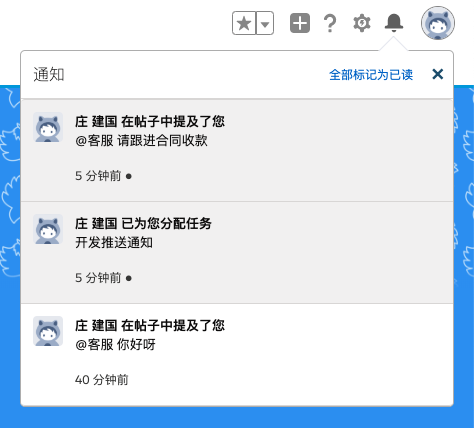

有新消息到达时，Steedos 在页面右上角显示推送通知提醒。


点击推送通知图标，可以查看通知内容。



## 标准业务对象

标准业务对象内置以下通知功能。

### 审批通知

- 待审核
- 传阅
- 申请单已核准
- 申请单已驳回

### 任务通知

- 待办任务

## 自定义业务对象

自定义业务对象，如需发送推送通知，只需插入一条记录到 notifications 。例如

```yml
name: 庄建国给您安排了一个任务
related_to:
  o: tasks
  ids: ["task_id"]
related_name: 开发推送通知功能
url: http://link_url
```
