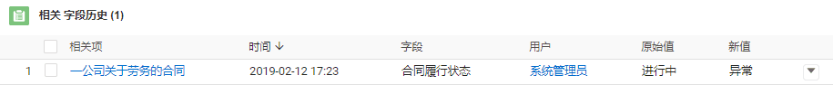

# 对象审计日志
通过在对象上设置`enable_audit=true`来开启对象的审计日志功能。
如果在对象中开启了“跟踪字段历史”功能，系统会自动记录字段中数据的修改历史。

## 字段值存储规则
- 日期： 格式存储为 (String): 2018-01-02
- 时间： 格式存储为 (String): 2018-01-02 23:12
- lookup 和下拉框：都是对应的显示名称 (name | label)
- boolean ：是/否
- 多行文本/grid/lookup有optionsFunction并且没有reference_to时:不记录新旧值, 只记录修改时间, 修改人, 修改的字段显示名

## 显示当前对象记录的审计日志
- 记录详细界面上， 如果当前用户对当前对象有modifyAllRecords权限， 则在以相关列表显示当前记录的字段历史列表

## 显示所有对象记录的审计日志
对于系统管理员或其他设置了`permission_sets = admin`的用户，在 设置-高级-字段历史 里可以看到所有开启了“跟踪字段历史”的对象的字段修改历史记录。

## 补充说明
- 不记录相关对象的新增，修改
