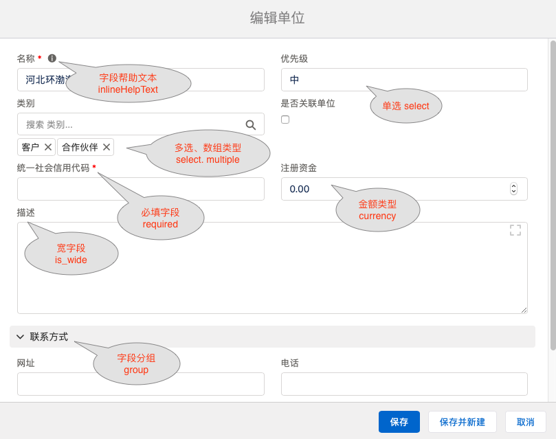

Steedos 默认使用MongoDB数据库，相比传统的SQL数据库，可以额外实现数组、内嵌对象、内嵌表格等高级字段类型。

## 字段属性
每个字段都可以配置以下属性，定义字段的功能和界面操作。
- 字段名(name): 字段在数据库中保存的名称。
- 显示名(label): 字段在最终用户界面上的显示名称。如果系统检测到翻译 "objectname_fieldname"，以翻译为准。
- 默认值(defaultValue): 可配置默认值[公式](object_field_formula.md)，例如 {userId}, {spaceId} 等
- 必填(required)
- 帮助文本(inlineHelpText): 表单填写时显示的帮助文本
- 宽字段(is_wide): 显示时占两列，默认只占一列
- 分组(group)：在显示记录时可按分组显示字段
- 多选(multiple)：文本、选择类型字段添加此属性，可以实现多选功能，数据库中保存也是对应的数组类型。
- 可搜索(seachable): 当用户在此对象中执行搜索时，会同时搜索此字段的内容
- 可排序(sortable): 用户在浏览记录时，可以按照此字段执行排序操作。可排序字段系统会自动创建索引。默认为不可排序
- 索引(index): 指定是否在数据库中为此字段创建索引，默认为不创建索引。
- 只读(readonly): 应该只显示在查看页面或列表页面上，新增和修改页面都不显示 #todo
- 隐藏(hidden): 包括列表、表单、编辑界面在内的所有界面都不显示
- 编辑时忽略(omit): 只是新建和编辑表单中不显示，列表、表单详细界面等都可能显示。
- 标题字段(is_name): 表示此字段为标题字段，适用于标题字段并不是"name"时，在列表页生成链接
- 禁用(disabled) 
- 黑箱字段(blackbox): Steedos在做数据验证时，忽略此字段的内容。
- 值范围(allowedValues): 此字段的值必须在此范围之内。



## 系统字段
如果使用Steedos默认数据源，每个Steedos对象都会自动创建一些系统字段。

### 所属工作区 space
Steedos可以分工作区保存用户数据，每个用户可以属于多个工作区。
space字段值在记录创建时生成，默认为当前选中的工作区。
当在视图中定义了 filter_scope: space 时，自动按照此字段过滤。

### 所属责任人 owner
owner字段用于保存当前记录的责任人，例如合同的经办人，客户的负责人等。
当在视图中定义了 filter_scope: mine 时，自动按照此字段过滤。
字段值记录创建时自动生成，默认为当前用户。如果需要让用户自主选择，可以在代码中增加配置。
```yaml
  owner: 
    label: 责任人
    omit: false
    hidden: false
```

### 所属单位 company_id
Steedos可以控制单位级别权限，授权默写用户只能查看/修改本单位的数据。
company_id字段用于标记记录责任人的所属单位，默认为隐藏(hidden)自动赋值。
如果需要由用户在界面上选择，可以增加如下配置覆盖此字段属性。
```yaml
  company_id: 
    label: 所属单位
    omit: false
    hidden: false
```
### 审计相关
以下字段用于记录审计相关信息，系统会自动赋值。
- 创建日期(created)：记录创建时生成，默认为当前时间
- 创建人(created_by)：记录创建时生成，默认为当前用户
- 修改日期(modified)：记录修改时生成，默认为当前时间
- 修改人(modified_by)：记录修改时生成，默认为当前用户
- 已删除(is_deleted)：字段类型为布尔(boolean)，默认为隐藏(hidden)、编辑时忽略(omit)
- 删除日期(deleted)：默认为隐藏(hidden)、编辑时忽略(omit)
- 删除人(deleted_by)：默认为隐藏(hidden)、编辑时忽略(omit)

### 审批相关
- 已锁定(locked)：字段类型为布尔(boolean)，默认为隐藏(hidden)、编辑时忽略(omit)
- 记录的相关审批单(instances)：默认为隐藏(hidden)、编辑时忽略(omit)
