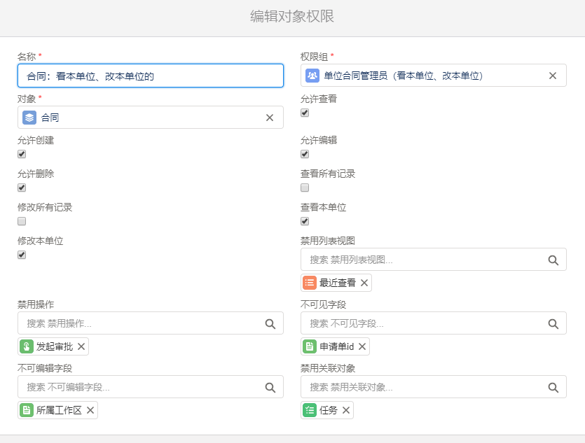

对象权限
===

可以为[权限组](permission_set.md)对应的用户设定对象级别的权限。当一个用户属于多个权限组时，实际拥有的权限为各权限组的最大权限。

### 对象记录权限配置
- 允许查看allowRead：用户可以查看到所有者是自己或是共享给自己的记录
- 允许创建allowCreate：用户可以创建记录
- 允许修改allowEdit：用户可以修改所有者是自己或是共享给自己的记录
- 允许删除allowDelete：用户可以删除所有者是自己或是共享给自己的记录
- 查看本单位viewCompanyRecords：用户可以查看对象中“所属单位”(company_id)是我的所属单位的所有记录
- 修改本单位modifyCompanyRecords：用户可以修改对象中“所属单位”(company_id)是我的所属单位的所有记录
- 查看所有记录viewAllRecords：用户可以查看对象中的所有记录
- 修改所有记录modifyAllRecords：用户可以修改对象中的所有记录

> 上述权限有级联变更限制
```
if po.allowCreate
  po.allowRead = true
if po.allowEdit
  po.allowRead = true
if po.allowDelete
  po.allowEdit = true
  po.allowRead = true
if po.viewAllRecords
  po.allowRead = true
if po.modifyAllRecords
  po.allowRead = true
  po.allowEdit = true
  po.allowDelete = true
  po.viewAllRecords = true
if po.viewCompanyRecords
  po.allowRead = true
if po.modifyCompanyRecords
  po.allowRead = true
  po.allowEdit = true
  po.allowDelete = true
  po.viewCompanyRecords = true
```

### 对象其他权限配置
- 不可见字段unreadable_fields: 用户在界面上看不到指定字段
- 不可编辑字段uneditable_fields： 用户在界面上能看到指定字段，但是不可修改
- 禁用列表视图disabled_list_views： 用户看不到指定的列表视图
- 禁用关联对象unrelated_objects： 用户在记录相关列表中，看不到对应的子表
- 禁用操作disabled_actions: 用户在记录显示页面中，看不到对应的操作按钮


