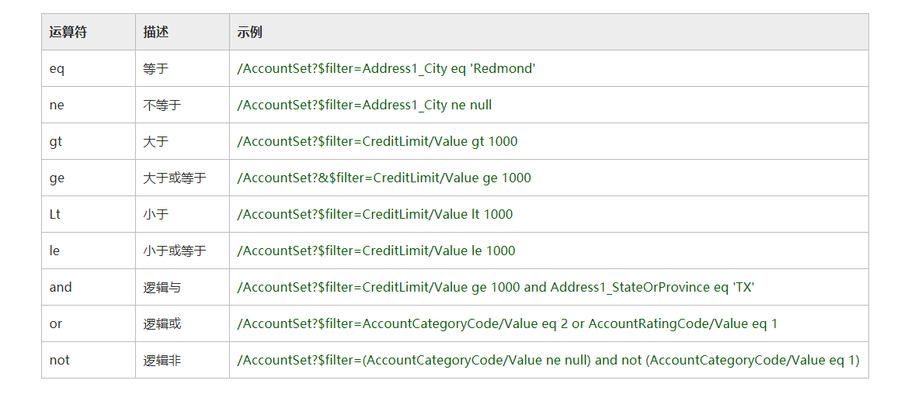

```shell
GET /api/v4/{object_name}/
```

此接口用于查询业务数据，其中 {object_name} 需替换为业务对象名称。

接口只会返回当前用户授权访问的业务数据。

## 请求参数
请求参数在URL中传入。

### $select
指定要返回的字段及顺序。 如果不指定$select，返回业务对象的所有列。

### $filter
指定数据的查询条件，可以使用括号表示分组。

以下列出 odata query支持的运算符。
	

时间值的必须使用以下格式：2010-07-15T16:19:54Z。

### $orderby
确定使用哪些值对数据进行排序。 默认情况下，顺序为升序。使用 desc 使顺序反向或使用 asc 显式设置默认值。

例如，若要按修改时间逆序排序，请使用查询 $orderby=modified desc

### $skip
设置在返回数据前要跳过的记录数。

### $top
设置要返回的最大记录数。

### $expand
设置需要扩展返回的相关记录，只有lookup或master/detail类型的字段，可以使用$expand功能。

### $count
在结果中返回符合查询条件的记录总数。

## 返回结果
返回数组。

## 示例
查询联系人(contacts)的数据，并展开对应的单位(account)信息。
```shell
GET http://localhost:5000/api/v4/contacts/?$top=50&$select=name,account,email,phone,owner,company_id,locked&$expand=account&$count=true
```

响应
```
{  
   "@odata.context":"http://localhost:5000/api/v4/$metadata#contacts",
   "@odata.count":2,
   "value":[  
      {  
         "@odata.id":"http://localhost:5000/api/v4/contacts('K6xNbprvtbpsdj2Jf')",
         "@odata.etag":"W/\"K6xNbprvtbpsdj2Jf\"",
         "@odata.editLink":"http://localhost:5000/api/v4/contacts('K6xNbprvtbpsdj2Jf')",
         "_id":"K6xNbprvtbpsdj2Jf",
         "name":"庄建国",
         "account":{  
            "_id":"S9GvFQnr4zFeo3Tip",
            "name":"上海华炎软件科技有限公司",
            "reference_to.o":"accounts",
            "_NAME_FIELD_VALUE":"上海华炎软件科技有限公司"
         },
         "owner":"5194c66ef4a563537a000003",
         "phone":"021-37693151",
         "email":"zhuangjianguo@hotoa.com"
      },
      {  
         "@odata.id":"http://localhost:5000/api/v4/contacts('9KwhPD6moaLR9YXL2')",
         "@odata.etag":"W/\"9KwhPD6moaLR9YXL2\"",
         "@odata.editLink":"http://localhost:5000/api/v4/contacts('9KwhPD6moaLR9YXL2')",
         "_id":"9KwhPD6moaLR9YXL2",
         "name":"田骐",
         "account":{  
            "_id":"S9GvFQnr4zFeo3Tip",
            "name":"上海华炎软件科技有限公司",
            "reference_to.o":"accounts",
            "_NAME_FIELD_VALUE":"上海华炎软件科技有限公司"
         },
         "email":"tianqi@hotoa.com",
         "phone":"021-37693156",
         "owner":"5194c66ef4a563537a000003"
      }
   ]
}
```