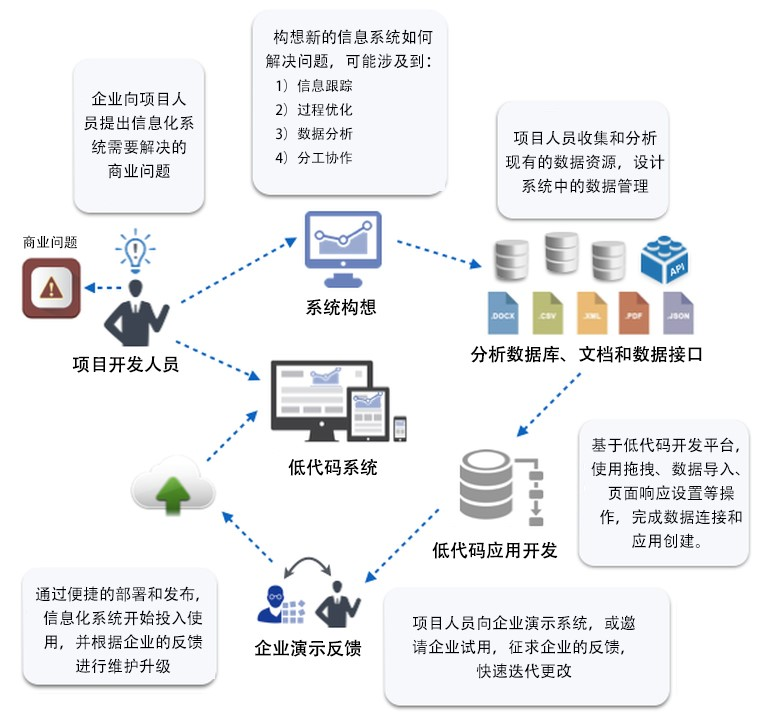
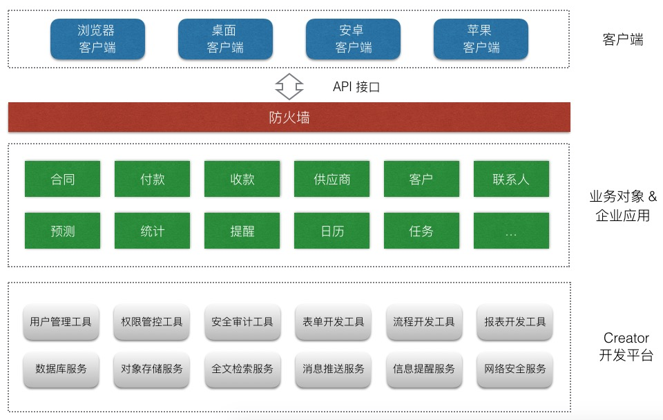
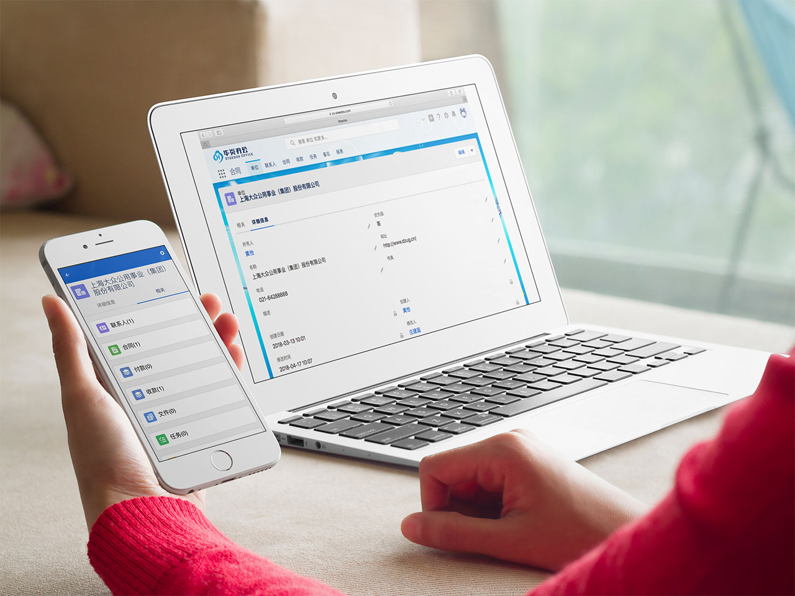
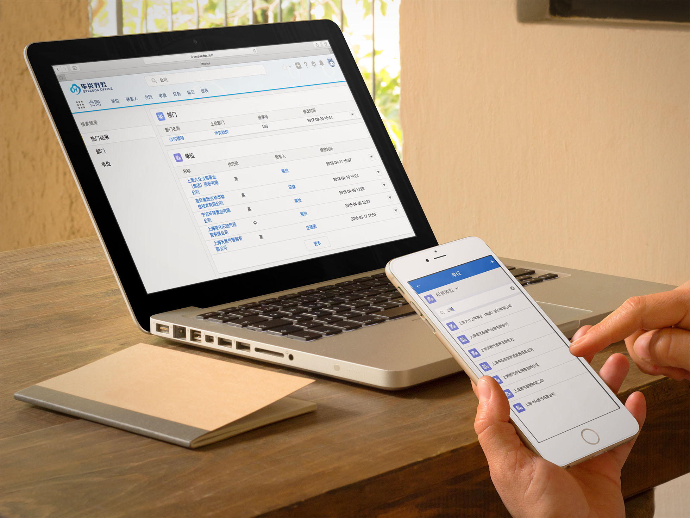
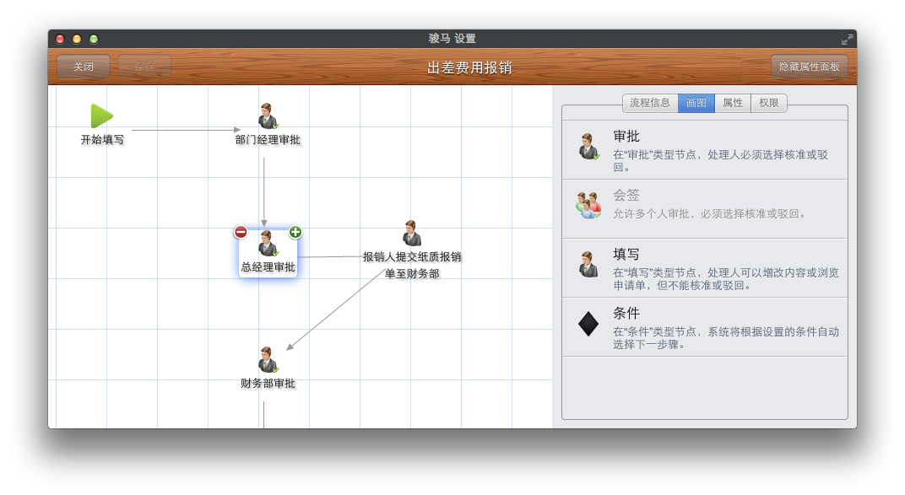

## 问题的提出
长久以来，开发企业软件系统需要大量的硬件投资，需要业务部门提出精准的业务需求，并需要身价昂贵的顾问来设计应用程序。一旦系统建成后，就很难修改和升级，所以这类系统都会维持很多年，有时甚至十几年都不会经历大规模的升级。导致大部分中国企业还使用着难用难看的企业软件系统。

同时传统的企业软件固化的功能和业务流程，给企业的手脚上了绑，越是运转高效的组织，越自然而然限定了自身的天花板，丧失了动态创新的能力，每一个变化带着沉重的枷锁和包袱。大量优秀的创意和实现、以及过程的试错，只发生创新企业和互联网公司，好像就和传统企业压根儿没关系。

时代在变，这一切正在发生着变化……  

低代码平台来了。

## Steedos “低代码”开发平台
低代码开发平台，是指无需编码或很少代码（No Code or Low Code）就可以快速生成应用程序的工具，提供可视化的设计工具来快速搭建界面、设计数据模型、创建业务逻辑和工作流。

Steedos “低代码”开发平台由专注于细节的工程师精心打造，平台的每个功能设计都旨在帮助开发人员更快地构建和交付更好的应用程序。使用Steedos“低代码”开发平台，开发人员和业务用户通过少量代码就可以构建企业级应用程序，一方面可以降低企业应用开发人力成本，另一方面可以将原有数月甚至数年的开发时间成倍缩短，从而帮助企业实现降本增效的价值。

### 迭代式项目开发流程
Steedos“低代码”开发平台非常适合于客户无法具体描述需求、需要在开发过程中深度参与的项目，它可以帮助我们在几周，甚至几天内，搭建出应用程序的框架并交付客户试用。然后，根据客户的反馈，我们确定把前期开发的程序作为抛弃式的原型，只用于收集用户需求；或者是在当前程序的基础上通过迭代式的开发不断丰富其功能。

低代码模式下，业务部门的主管可以取代开发人员推动应用程序的功能开发，成为开发过程中活跃的一部分。每一个用户都是敏捷模式，无论他是否会编写程序，每一个人都是创造者和分享者，创意的裂变无处不在。

自从 Forrester 创造了“低代码开发平台”术语以来，每年都会对低代码开发平台领域做出报告分析，根据 Forrester 的报告，低代码开发平台市场将从2015年的17亿美金增长至2020年的155亿美金，5年时间增长接近十倍。

### 无与伦比的开发速度
Steedos可以帮助开发人员以极快的速度直观地开发您的企业应用程序，并快速部署到电脑、安卓、苹果三个平台。Steedos通过配置业务对象的方式定义数据模型，与传统的ORM工具不同，Steedos业务对象配置文件除了包含表、字段、关系的定义，还可设定前台的显示样式、过滤条件、排序方式、用户权限，并可开启已预置的企业级功能组件，例如允许上传附件、允许假删除、允许评论、开启审批、记录修订历史等。
​​

当现有功能不能满足您的需求时，您可通过编写自定义代码进行个性化开发，例如添加后端数据触发器（新增前、新增后、修改前、修改后、删除前、删除后）、扩展界面操作按钮，编写前端操作脚本、修改系统样式等。是的，您只需要编写必要的业务逻辑代码即可，整体系统框架由Steedos自动生成。

### 快速响应需求变更
与传统的“代码生成平台”不同，Steedos “低代码”平台创建的应用程序，开发人员只需编写和维护核心业务逻辑的代码，而不是自动生成的庞大代码库。系统整体框架由Steedos负责统一维护和版本更新，并定期发布到npm服务中，开发人员只需要改一个内核版本号即可实现内核的功能和安全性升级。

因此，当业务需求扩张时，Steedos “低代码”平台创建的应用程序，可以轻松地进行定制和强化。例如，如果用户有了新的需求，那么开发人员可以在几个小时内完成应用程序的修改，以满足这些需求。

### 轻松连接现有业务系统
Steedos不仅可以用于开发新系统，还可以轻松连接到现有的业务系统，进行功能扩展与集成开发。您只需配置数据库连接，就可以连接到 SQL Server, Oracle, Mysql, PostgresQL, Sqlite 等常用数据库，Steedos会自动读取数据库结构，帮您初始化业务对象的配置文件。

当您将现有业务系统接入到Steedos之后，用户可以在同一个界面中查看/关联来自各个业务系统中的数据，并可通过手机访问。每一个业务对象都可以单独设定访问权限，Steedos会自动为您的业务系统生成符合国际标准的API接口，您可以在开发新系统时随时调用这些接口与已有业务系统互通数据，最终用户还可以通过Excel调用远程业务系统中的数据，进行统计分析。

### 源码版本管理与回溯
与其他只提供图形化界面的“低代码”开发平台不同，Steedos中所有的开发内容均以源码的方式保存在项目文件夹中，开发人员可以充分利用现有的版本管理工具（推荐使用github.com）进行源代码的版本管理，系统的每一次修订均可清晰的记录在版本库中。当系统出现任何故障时，开发人员都可以迅速回溯到之前稳定的版本。

### 自动生成标准化API接口
开发人员只需配置业务对象并编写核心业务逻辑代码，系统自动生成基于国际标准 ODATA（微软提出）和 GraphQL (Facebook提出) 协议的API接口。系统管理员可在管理后台设定最终用户对每一个业务对象的访问权限，每一位授权用户均可在各自的授权范围内查询与操作业务数据。开发人员也可以利用成熟的API接口，与外网网站、内网门户及第三方业务系统进行集成，或是开发个性化的用户界面。

## 美观的业务操作界面
提供干净和直观的体验对于任何应用程序来说都是一项挑战，为大型，元数据驱动和完全可定制的系统进行大规模的开发更是一项非凡的成就。Steedos 最终用户界面基于Salesforce Lightning Design System 设计， 开发人员无需编写一行界面代码，即可获得美观，整洁，直观的用户体验。包括可自定义的列表界面、根据业务对象配置文件自动生成的记录查看与编辑界面、查找与筛选界面、统计分析界面。

同时，针对苹果和安卓手机用户，Steedos会自动生成在小屏幕设备上易于查看与操作的手机版界面，用户即使不在办公室，也能随时登录业务系统，进行业务操作。

​​
### 列表视图

列表视图是业务人员操作业务对象的主入口，用列表的方式展示业务数据。开发人员可以为每个业务对象可以配置多个列表视图，例如对于“任务”对象，可配置待办任务、已办任务、交办任务三个视图。通过配置列表视图，可设定列表界面上展示的字段和排序规则，指定数据过滤条件。
​​
业务人员通过列表视图在权限范围内浏览数据，调整字段顺序，更改排序方式，变更筛选条件，也可以通过高级搜索界面进行精确检索。对于后台设定为过滤类型字段，业务用户可以进行快捷筛选。业务人员可以将搜索条件保存为新的自定义视图，留待下次使用或是共享给其他用户使用。

如果业务人员被授予数据修改的权限，双击数据单元格，可以直接修改具体字段的内容。如果选中多条记录再双击数据格，还可实现批量修改的功能。

### 记录查看视图
点击列表视图中的具体记录，即可进入记录查看视图。记录查看视图中的每一个字段及显示方式均由开发人员在配置文件中指定。开发人员可以指定字段的名称、类型、先后顺序，并可将字段进行分组显示。
​​
业务人员可以在此界面查看业务数据。被授予修改权限的业务人员可以点击编辑按钮编辑整条记录，也可以双击具体字段进行快捷修改。业务对象的相关子表，也会显示在记录查看视图中，例如对于“采购订单”对象，会同步显示相关的附件、采购物品明细、分期付款进度等子表内容。

当业务数据需要协作时，开发人员可以开启评论开关，记录查看视图会显示讨论对话框，每位授权用户均可填写评论与备注。

对于敏感的业务数据，开发人员可以开启审计开关并设定审计字段，业务人员对于审计字段的任何修改均会计入审计台账，供系统管理员查询。

### 全局搜索视图
有了Steedos，搜索数据变得非常轻松。只需要在界面顶端键入搜索关键词，即可在所有业务对象中检索数据。业务人员可以输入多个关键词进行组合检索，系统会自动识别当前用户对业务数据的访问权限，只返回被授予权限的业务数据。
​​

## 功能强大的系统管理后台
Steedos 开发的应用系统提供功能强大的系统管理后台，帮助系统管理员设定组织结构、对业务对象进行授权与管控、配置业务审批流程、设计统计报表以及查看系统日志。

### 用户认证与组织机构管理
Steedos 开发的应用系统内置用户认证的完整流程，包括用户注册、用户登录、取回密码、用户资料设定等基本功能。系统管理员可以在后台配置公司的组织架构，更改用户资料，设定部门成员与上下级关系。

系统支持以多租户方式运行，集团企业可以为每个下属单位创建独立的工作区，管理各自的业务数据。

### 安全管控与审计工具
应用系统的安全性非常关键，Steedos不断升级的系统内核，统一的权限管理体系，统一的API访问入口，确保您的应用程序从设计到部署都是安全的。无论是通过系统界面还是API接口，任何用户只能在被授予的范围之内进行数据查询与修改操作。

除了基本的基于角色的增删改查权限控制，Steedos还可以将权限精确到单位级，设置针对具体业务对象设定字段级的访问权限。权限可以由开发人员在配置文件中指定，也可以交付给用户之后由系统管理员在后台设置界面中配置。

同时，为确保业务数据的不被非法篡改，Steedos还内置强大的安全审计引擎，开发人员只需简单配置，即可启用安全审计功能，为您的业务数据保驾护航。例如当业务对象中关键字段发生变更时，Steedos可以自动记录安全审计日志，包括修改人、修改时间、字段修改内容；当核心业务数据被删除时，并非在数据库里真删除、而是打上已删除的标记，并自动记录操作人员和操作时间；对于保密性强的数据，系统还可记录查询日志。

### 审批流程设计工具
对于需要审批的业务数据，例如合同、付款、请假等，系统管理员可通过图形化的工具来配置审批流程，并与业务数据实现互通。

表单设计工具：以图形方式设计各种类型的审批表单。按照实际情况的不同，字段可以被设置为文本、数值、日期、勾选框、下拉框、单选、多选、选择用户、选择部门等类型，也可以将字段组合为分组、表格。还可以按照实际的纸质表单的样子来设置系统中的表单显示样式。

流程设计工具：以图形方式设计各种类型的审批流程，实现包括公文、业务的各种过程控制。该流程引擎覆盖了符合中国用户特点的政府、企业事业单位和专业领域工作流业务系统的需求，基于平台无关性的工作流引擎适合不同行业用户、不同类型的应用系统。在流程设计过程中，用户不需要设计表、不用与数据库打交道，而是通过绘制流程图来描述业务的办理过程。可以设计条件判断，支持处理数百个节点的复杂流程。
​​

业务报表设计工具：Steedos开发平台内置功能强大的报表统计与分析功能，业务人员可通过简单设定，配置出列表、分组报表、二维表进行统计分析，并可自动生成图形化报表。在报表顶部用图形化方式显示统计数据，可以显示为柱状图、折线图、饼图。设置时，还可以对特定的字段进行计数、小计、合计等统计处理。通过设定报表的查询条件，可以将统计范围缩小，提高报表的运行速度。例如可以设定只统计某个时间段的数据。平台会自动根据后台配置的用户权限，只对用户权限范围内的数据进行汇总统计。

## 更安全的私有云部署模式
Steedos 是Salesforce、Zoho、OutSystems等云端低代码开发平台的的私有云替代方案，使用Steedos开发的应用可运行于您的防火墙或VPN后，使您对公司的业务数据拥有完整所有权和控制权。虽然Steedos与其他云端工具都具有灵活性，效率和创新优势，但Steedos应用的私有云部署模式独特地提供了顶级企业所需的控制，隐私，法律合规性，可定制性和可扩展性。

### 高可用性与集群扩展
Steedos基于大数据架构设计，无论用户数量，复杂程度或数据量如何，您开发的应用系统都会表现出色。Steedos 服务端基于NodeJS平台，数据库采用MongoDB，可按集群模式部署，提供高可用性和横向扩展。支持10万级的用户在一个工作区中协作，并且可以在集团企业中部署数千个独立工作区。